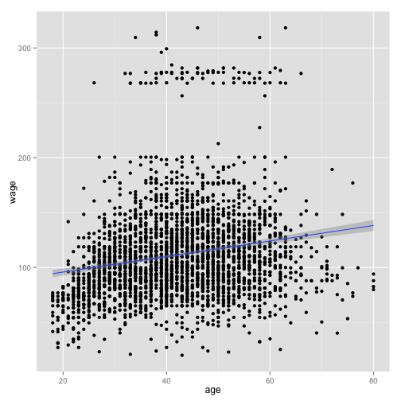

## Mid-Atlantic Wage Data

Wage Data Variables:


```
##  [1] "year"       "age"        "sex"        "maritl"     "race"      
##  [6] "education"  "region"     "jobclass"   "health"     "health_ins"
## [11] "logwage"    "wage"
```

Wage Data Record Example:


```
##        year age     sex           maritl     race       education
## 231655 2006  18 1. Male 1. Never Married 1. White    1. < HS Grad
## 86582  2004  24 1. Male 1. Never Married 1. White 4. College Grad
##                    region       jobclass         health health_ins
## 231655 2. Middle Atlantic  1. Industrial      1. <=Good      2. No
## 86582  2. Middle Atlantic 2. Information 2. >=Very Good      2. No
##         logwage     wage
## 231655 4.318063 75.04315
## 86582  4.255273 70.47602
```

--- .class #id 

## Target and Variable

Relationship Between age and wage

 

--- .class #id 

## Models

Trying to compare modles as follow

* Linear Regression: 

* SVM Linear Regression:

* Regression Tree:

--- .class #id 

## Experiment Plan

### Error Metric

* Root Mean Square Error: sqrt(mean((test$y - pred$y)^2))

### Cross Validation 

Train and Test set split size: 6:4


```r
set.seed(12345)
in.train <- createDataPartition(y=Wage$wage, p=0.6, list=FALSE)
tr.set <- Wage[in.train,]; te.set <- Wage[-in.train,]
c(dim(tr.set), ",", dim(te.set))
```

```
## [1] "1802" "12"   ","    "1198" "12"
```

